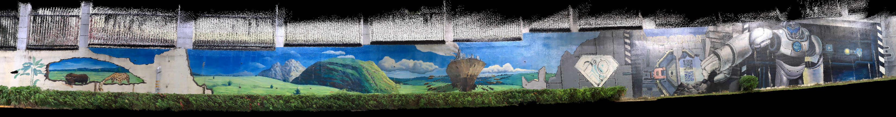
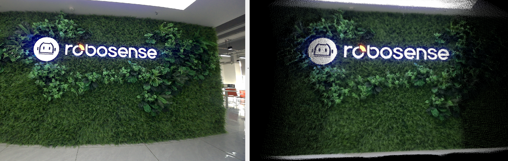

# RS-FAST-LIVO

[中文介绍](README_CN.md) 

## 1. Introduction

This repository adapts the state-of-the-art LiDAR-Inertial-Visual odometry system, `FAST-LIVO`, to   our lidar product Active Camera.

**FAST-LIVO** is a fast LiDAR-Inertial-Visual odometry system, which builds on two tightly-coupled and direct odometry subsystems: a VIO subsystem and a LIO subsystem. The LIO subsystem registers raw points (instead of feature points on e.g., edges or planes) of a new scan to an incrementally-built point cloud map. The map points are additionally attached with image patches, which are then used in the VIO subsystem to align a new image by minimizing the direct photometric errors without extracting any visual features (e.g., ORB or FAST corner features).

<div align="center">
    
</div>

If you need further information about the `FAST-LIVO` algorithm, you can refer to their official website and contributors:
- **Website**: <https://github.com/hku-mars/FAST-LIVO>
- **Contributors**: [Chunran Zheng 郑纯然](https://github.com/xuankuzcr)， [Qingyan Zhu 朱清岩](https://github.com/ZQYKAWAYI)， [Wei Xu 徐威](https://github.com/XW-HKU)

## 2. Demos

### 2.1 Using Robosense  Active Camera

<div align="center">   
     
    <p style="margin-top: 2px;">"HIT SZ Wall" sequence. left: raw image, right: mapping result</p>
</div>

<div align="center">   
     
    <p style="margin-top: 2px;">"HIT SZ Wall" sequence. full mapping result</p>
</div>

<div align="center">   
     
    <p style="margin-top: 2px;"> "indoor robosense logo" sequence. left: raw image, right: full mapping result </p>
</div>

## 3. Prerequisited

### 3.1 ROS2

Follow the specified content in the [official tutorial](https://fishros.org/doc/ros2/humble/Installation.html) for your operating system.

### 3.2 Sophus

 Sophus Installation for the non-templated/double-only version.

```bash
git clone https://github.com/strasdat/Sophus.git
cd Sophus
git checkout a621ff
mkdir build && cd build && cmake ..
make
sudo make install
```

## 4. Install and Build

Clone this repository into a  create an existing `ros2` workspace and execute the following command to build and install:  

```bash
colcon build --symlink-install 
```

## 4. Run the package

### 4.1 Important parameters

Edit `config/RS_META.yaml` to set the below parameters:

#### 4.1.1 Algorithm

- `lid_topic`: The topic name of LiDAR data.
- `imu_topic`: The topic name of IMU data.
- `img_topic`: The topic name of camera data.
- `img_enable`: Enbale vio submodule.
- `lidar_enable`: Enbale lio submodule.
- `point_filter_num`: The sampling interval for a new scan. It is recommended that `3~4` for faster odometry, and `1~2` for denser map.
- `outlier_threshold`: The outlier threshold value of photometric error (square) of a single pixel. It is recommended that `50~250` for the darker scenes, and `500~1000` for the brighter scenes. The smaller the value is, the faster the vio submodule is, but the weaker the anti-degradation ability is.
- `img_point_cov`: The covariance of photometric errors per pixel. 
- `laser_point_cov`: The covariance of point-to-plane redisual per point. 
- `filter_size_surf`: Downsample the points in a new scan. It is recommended that `0.05~0.15` for indoor scenes, `0.3~0.5` for outdoor scenes.
- `filter_size_map`: Downsample the points in LiDAR global map. It is recommended that `0.15~0.3` for indoor scenes, `0.4~0.5` for outdoor scenes.
- `pcd_save_en`: If `true`, save point clouds to the PCD folder. Save RGB-colored points if `img_enable` is `1`, intensity-colored points if `img_enable` is `0`.
- `delta_time`: The time offset between the camera and LiDAR, which is used to correct timestamp misalignment.

After setting the appropriate topic name and parameters, you can directly run **RS-FAST-LIVO** on the dataset.

#### 4.1.2 extrinsic and intrinsic

- `extrinsic_T`: translation of LiDAR with respect to IMU
- `extrinsic_R:`: rotation of LiDAR with respect to IMU 
- `Rcl`: translation of LiDAR with respect to camera
- `Pcl`: rotation of LiDAR with respect to camera 
- `camera_pinhole_rs.yaml`: camera intrinsic

### 4.2 Run on dataset

Download our collected rosbag files via OneDrive ([FAST-LIVO-Datasets](TODO)) containing **xx** rosbag files.

```bash
ros2 run slam slam_node
```

## 5. Acknowledgments

Thanks for [FAST-LIVO](https://github.com/hku-mars/FAST-LIVO), [FAST-LIVO2](https://github.com/hku-mars/FAST-LIVO2) and [VINS-Mono](https://github.com/HKUST-Aerial-Robotics/VINS-Mono)

## 6. License

The source code of this package is released under [**GPLv2**](http://www.gnu.org/licenses/) license.